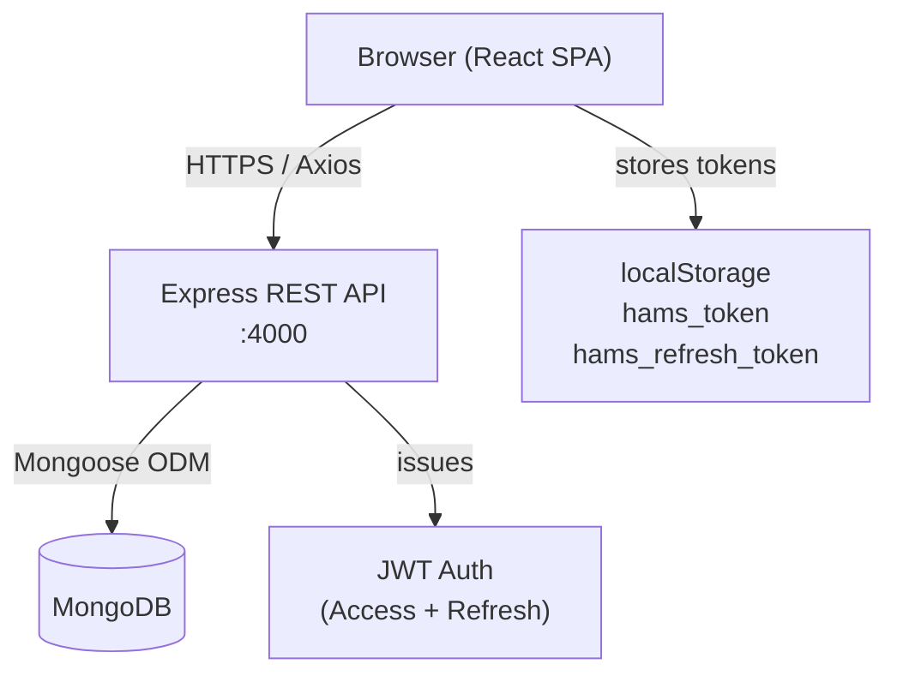
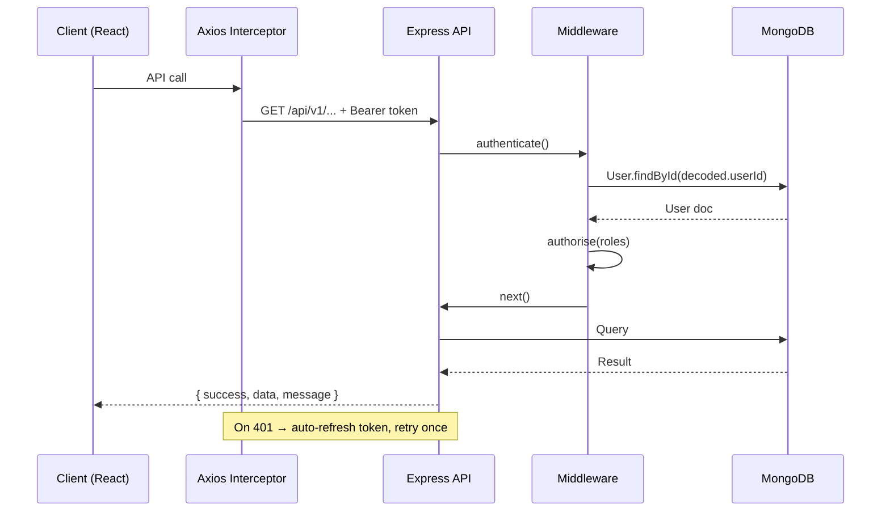
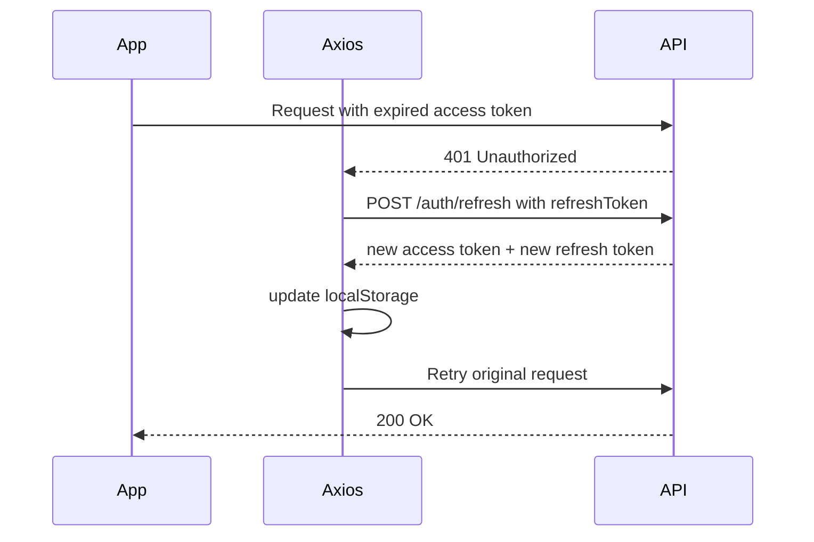

# HAMS — Healthcare Appointment Management System

## Table of Contents

1. [Project Overview](#1-project-overview)
2. [Architecture](#2-architecture)
3. [Tech Stack](#3-tech-stack)
4. [Data Models](#4-data-models)
5. [API Reference](#5-api-reference)
6. [Frontend Structure](#6-frontend-structure)
7. [Authentication & Authorization](#7-authentication--authorization)
8. [Key Features & Business Logic](#8-key-features--business-logic)
9. [Slot Suggestion Algorithm](#9-slot-suggestion-algorithm)
10. [Test Coverage](#10-test-coverage)
11. [Environment Configuration](#11-environment-configuration)
12. [Development Setup](#12-development-setup)

---

## 1. Project Overview

HAMS is a full-stack healthcare appointment management platform with two user roles — **Patient** and **Doctor**. Patients discover doctors, book time slots, and track appointments. Doctors manage availability, confirm appointments, and write clinical notes into an Electronic Health Record (EHR) per patient.

**Monorepo layout**

```
hams/
├── hams-backend/      Express + MongoDB REST API
└── hams-frontend/     React + MUI SPA
```

---

## 2. Architecture

### System Architecture Diagram



### Request Flow



### Frontend Layout Architecture

```
┌──────────────────────────────────────────────────────┐
│  HEADER (fixed, 64px)                                │
│  [🏥 HAMS logo → home]        [avatar] [email]       │
│                                [role chip] [Logout]  │
├────────────┬─────────────────────────────────────────┤
│  SIDEBAR   │  MAIN CONTENT AREA                      │
│  (232px /  │                                         │
│   64px     │  <PageWrapper>                          │
│   collapsed│    title + Divider                      │
│   toggle)  │    page content                         │
│            │  </PageWrapper>                         │
│  Patient:  │                                         │
│  Dashboard │                                         │
│  Book Appt │                                         │
│  My Appts  │                                         │
│            │                                         │
│  Doctor:   │                                         │
│  Dashboard │                                         │
│  Schedule  │                                         │
│  Avail.    │                                         │
└────────────┴─────────────────────────────────────────┘
```

---

## 3. Tech Stack

### Backend

| Layer | Technology |
|---|---|
| Runtime | Node.js |
| Framework | Express 5 |
| Language | TypeScript 6 |
| Database | MongoDB via Mongoose 9 |
| Auth | JWT (jsonwebtoken) — access (15 min) + refresh (7 days) |
| Password hashing | bcryptjs (12 rounds) |
| Validation | Joi |
| Logging | Winston + Morgan |
| Security | Helmet, CORS, express-rate-limit |
| API Docs | Swagger UI (`/api-docs`) |
| Testing | Jest + Supertest + mongodb-memory-server |
| Dev server | ts-node-dev |

### Frontend

| Layer | Technology |
|---|---|
| Framework | React 19 |
| Language | TypeScript 6 |
| UI Library | MUI v5 (Material UI) |
| Routing | React Router v7 |
| Forms | react-hook-form + zod |
| HTTP | Axios (with interceptors) |
| Date utilities | dayjs |
| Build | Vite |
| Unit tests | Vitest + Testing Library |
| E2E tests | Playwright (Chromium, Firefox, WebKit) |

### Color Scheme

| Token | Hex | Usage |
|---|---|---|
| Primary | `#0B6FA4` | Nav active, buttons, header gradient |
| Primary Dark | `#084F78` | Hover states |
| Secondary | `#00A896` | Teal accents, success |
| Background | `#F2F6FA` | App canvas |
| Surface | `#FFFFFF` | Cards, sidebar |
| Text Primary | `#1A2B40` | Headings, body |
| Text Secondary | `#546E7A` | Subtitles, labels |
| Divider | `#E0E8F0` | Borders, separators |

---

## 4. Data Models

### Entity Relationship Diagram

```mermaid
erDiagram
    USER {
        ObjectId _id PK
        string email UK
        string passwordHash
        enum role "PATIENT|DOCTOR|ADMIN"
        boolean isActive
        Date createdAt
    }
    PATIENT {
        ObjectId _id PK
        ObjectId userId FK
        string firstName
        string lastName
        Date dateOfBirth
        string contactNumber
        string insuranceId
        string address
        enum bloodGroup
        string[] allergies
    }
    DOCTOR {
        ObjectId _id PK
        ObjectId userId FK
        string firstName
        string lastName
        string specialisation
        string licenseNumber
        string contactNumber
        string bio
        number consultationFee
        boolean isAvailable
    }
    TIMESLOT {
        ObjectId _id PK
        ObjectId doctorId FK
        Date startTime
        Date endTime
        number durationMinutes
        boolean isAvailable
    }
    APPOINTMENT {
        ObjectId _id PK
        ObjectId patientId FK
        ObjectId doctorId FK
        ObjectId slotId FK
        enum status "PENDING|CONFIRMED|CANCELLED|COMPLETED"
        enum type "IN_PERSON|TELEMEDICINE"
        string notes
        string cancelReason
    }
    EHR {
        ObjectId _id PK
        ObjectId patientId FK UK
        enum bloodGroup
        string[] allergies
        string[] chronicConditions
        string[] currentMedications
        ClinicalNote[] clinicalNotes
        Date lastUpdated
    }
    CLINICAL_NOTE {
        ObjectId doctorId FK
        string note
        Date createdAt
    }

    USER ||--o| PATIENT : "has profile"
    USER ||--o| DOCTOR : "has profile"
    DOCTOR ||--o{ TIMESLOT : "owns"
    PATIENT ||--o{ APPOINTMENT : "books"
    DOCTOR ||--o{ APPOINTMENT : "receives"
    TIMESLOT ||--|| APPOINTMENT : "fills"
    PATIENT ||--|| EHR : "has one"
    DOCTOR ||--o{ CLINICAL_NOTE : "writes"
    EHR ||--o{ CLINICAL_NOTE : "contains"
```

### MongoDB Indexes

| Collection | Index |
|---|---|
| User | `email` (unique) |
| Doctor | `specialisation`, `isAvailable` |
| TimeSlot | `{ doctorId, isAvailable }`, `startTime` |
| Appointment | `{ patientId, status }`, `{ doctorId, status }` |
| EHR | `patientId` (unique) |

---

## 5. API Reference

**Base URL:** `http://localhost:4000/api/v1`

All authenticated routes require: `Authorization: Bearer <token>`

All responses follow the envelope:
```json
{ "success": true, "message": "...", "data": { ... } }
```

### Auth (`/auth`)

| Method | Path | Auth | Role | Description |
|---|---|---|---|---|
| POST | `/register` | — | — | Register patient or doctor |
| POST | `/login` | — | — | Login, returns access + refresh tokens |
| POST | `/refresh` | — | — | Refresh access token |
| GET | `/me` | ✓ | Any | Get current user info |

**Register body (PATIENT)**
```json
{
  "email": "jane@example.com",
  "password": "Test@1234",
  "role": "PATIENT",
  "firstName": "Jane",
  "lastName": "Smith",
  "dateOfBirth": "1990-05-15",
  "contactNumber": "1234567890"
}
```

**Register body (DOCTOR)** — additionally requires:
```json
{
  "role": "DOCTOR",
  "specialisation": "Cardiology",
  "licenseNumber": "LIC001",
  "consultationFee": 150
}
```

**Password rules:** min 8 chars, must include uppercase, lowercase, digit, and special char (`@$!%*?&`).

---

### Appointments (`/appointments`)

| Method | Path | Auth | Role | Description |
|---|---|---|---|---|
| POST | `/` | ✓ | PATIENT | Book an appointment |
| GET | `/my` | ✓ | PATIENT, DOCTOR | Fetch own appointments (role-aware) |
| GET | `/:id` | ✓ | Any | Get appointment by ID |
| PATCH | `/:id/status` | ✓ | PATIENT, DOCTOR | Update status |

**Appointment type:** `IN_PERSON` or `TELEMEDICINE`

**Status transitions:**
```
PENDING → CONFIRMED (Doctor)
PENDING → CANCELLED (Patient or Doctor)
CONFIRMED → COMPLETED (Doctor)
CONFIRMED → CANCELLED (Patient or Doctor)
```

**Role-aware GET `/my`:**
- PATIENT → queries by `patientId`, populates `doctorId` + `slotId`
- DOCTOR → queries by `doctorId`, populates `patientId` + `slotId`

**Slot atomicity:** When an appointment is created, the `TimeSlot.isAvailable` is set to `false` in a Mongoose transaction. On cancellation, the slot is restored to `isAvailable: true`.

---

### Doctors (`/doctors`)

| Method | Path | Auth | Role | Description |
|---|---|---|---|---|
| GET | `/` | — | — | List all doctors (filter by `specialisation`, `isAvailable`) |
| GET | `/:id` | — | — | Get doctor by ID |
| GET | `/schedule/my` | ✓ | DOCTOR | Fetch own schedule (non-cancelled appointments) |
| POST | `/availability` | ✓ | DOCTOR | Add time slots |

**Set availability body:**
```json
{
  "slots": [
    { "startTime": "2026-05-01T09:00:00Z", "endTime": "2026-05-01T09:30:00Z", "durationMinutes": 30 }
  ]
}
```

Overlap detection: slots within the same submission are checked for time conflicts before insert.

---

### Slots (`/slots`)

| Method | Path | Auth | Role | Description |
|---|---|---|---|---|
| GET | `/suggest` | ✓ | Any | Get AI-scored slot suggestions |
| GET | `/doctor/:doctorId` | ✓ | Any | Get available slots for a doctor (optional `?date=`) |

**Suggest query params:** `doctorId`, `specialisation`, `preferredDate` (at least one required)

**Response:** Array of `{ slot, priorityScore }` sorted descending, capped at 10.

---

### EHR (`/ehr`)

| Method | Path | Auth | Role | Description |
|---|---|---|---|---|
| GET | `/my` | ✓ | PATIENT | Fetch own EHR |
| PATCH | `/my` | ✓ | PATIENT | Update own EHR (allergies, conditions, medications, blood group) |
| GET | `/:patientId` | ✓ | DOCTOR, ADMIN | Fetch patient EHR |
| POST | `/:patientId/notes` | ✓ | DOCTOR | Add clinical note to patient EHR |

**Clinical note body:**
```json
{ "note": "Patient presents with chest pain. ECG ordered." }
```
Note: min 10 chars, max 2000 chars.

---

### Error Codes

| HTTP | Class | When |
|---|---|---|
| 400 | Bad Request | Malformed request |
| 401 | UnauthorizedError | Missing/invalid/expired token |
| 403 | ForbiddenError | Authenticated but wrong role or wrong ownership |
| 404 | NotFoundError | Resource not found |
| 409 | ConflictError | Duplicate email, slot no longer available |
| 422 | ValidationError | Joi schema violation |
| 429 | Rate limit | > 100 requests / 15 min window |
| 500 | Internal | Unexpected server error |

---

## 6. Frontend Structure

### Route Map

```
/login                     → LoginPage           (public)
/register                  → RegisterPage         (public)

/dashboard                 → PatientDashboard     (PATIENT)
/book                      → BookAppointmentPage  (PATIENT)
/appointments              → MyAppointmentsPage   (PATIENT)

/doctor/dashboard          → DoctorDashboard      (DOCTOR)
/doctor/schedule           → SchedulePage         (DOCTOR)
/doctor/availability       → AvailabilityPage     (DOCTOR)
/doctor/ehr/:patientId     → PatientEHRPage       (DOCTOR)

/                          → redirect → /dashboard
*                          → NotFoundPage
```

### Component Tree

```
App
├── ThemeProvider (MUI)
├── BrowserRouter
│   └── AuthProvider
│       └── AppRoutes
│           ├── /login          → LoginPage
│           ├── /register       → RegisterPage
│           ├── ProtectedLayout [PATIENT]
│           │   └── AppLayout
│           │       ├── Header
│           │       │   ├── HAMS logo (→ /dashboard)
│           │       │   ├── Avatar + email + role chip
│           │       │   └── Logout button
│           │       ├── Sidebar (collapsible)
│           │       │   ├── Patient nav items
│           │       │   └── Collapse toggle
│           │       └── <Outlet> (page content)
│           └── ProtectedLayout [DOCTOR]
│               └── AppLayout
│                   ├── Header
│                   ├── Sidebar (Doctor nav items)
│                   └── <Outlet>
```

### Pages

| Page | Role | Key Components | Hooks Used |
|---|---|---|---|
| PatientDashboard | PATIENT | Stats cards, next appointment, AppointmentCard | `useAppointments` |
| BookAppointmentPage | PATIENT | 3-step Stepper, DoctorCard, SlotPicker | `useDoctors`, `useSlots`, `useAppointments` |
| MyAppointmentsPage | PATIENT | Tabs (All/Upcoming/Completed/Cancelled), AppointmentCard, ConfirmDialog | `useAppointments` |
| DoctorDashboard | DOCTOR | Stats cards, today's schedule list | `useAppointments` |
| SchedulePage | DOCTOR | Tabs (All/Pending/Confirmed/Completed), schedule list with confirm/EHR actions | `useAppointments` |
| AvailabilityPage | DOCTOR | AvailabilityForm, success Snackbar | `doctorService` |
| PatientEHRPage | DOCTOR | EHRViewer, ClinicalNoteForm | `useEHR` |

### Shared Components

| Component | Description |
|---|---|
| `AppLayout` | Shell: Header + Sidebar + main content |
| `Header` | Fixed top bar with logo, user info, logout |
| `Sidebar` | Permanent drawer, collapsible, role-aware nav |
| `PageWrapper` | Consistent page title + Divider + Container |
| `AppointmentCard` | Displays appointment with status badge and cancel action |
| `DoctorCard` | Doctor info card with select action |
| `SlotPicker` | Grid of scored slot chips |
| `StatusChip` | Coloured chip for appointment status |
| `ConfirmDialog` | Generic confirmation modal |
| `EmptyState` | Icon + title + subtitle placeholder |
| `LoadingSpinner` | Centered circular progress |
| `EHRViewer` | Read-only EHR display with clinical notes |
| `ClinicalNoteForm` | Textarea + submit for adding notes |
| `AvailabilityForm` | Dynamic slot form (add/remove rows) |

### State Management

State is local to hooks — no global store. Auth state lives in `AuthContext` (React Context).

| Hook | State | Persists |
|---|---|---|
| `useAuth` (AuthContext) | `user`, `isAuthenticated`, `isLoading` | Token in `localStorage` |
| `useAppointments` | `appointments[]`, `isLoading`, `error` | No |
| `useDoctors` | `doctors[]`, `isLoading`, `selectedDoctor` | No |
| `useSlots` | `slots[]`, `isLoading` | No |
| `useEHR` | `ehr`, `isLoading` | No |

### Token Lifecycle



---

## 7. Authentication & Authorization

### JWT Payload
```json
{ "userId": "<ObjectId>", "email": "user@example.com", "role": "PATIENT" }
```

### Middleware Chain (protected route)
```
authenticate → authorise(…roles) → validate(schema) → controller
```

**`authenticate`:**
1. Extract `Bearer` token from `Authorization` header
2. Verify with `JWT_SECRET`
3. Confirm user exists in DB and `isActive === true`
4. Attach `{ userId, email, role }` to `req.user`

**`authorise(...roles)`:**
- Checks `req.user.role` is in the allowed roles list
- Throws `ForbiddenError` if not

### Role Capability Matrix

| Action | PATIENT | DOCTOR | ADMIN |
|---|---|---|---|
| Register / Login | ✓ | ✓ | — |
| List doctors | ✓ | ✓ | ✓ |
| Book appointment | ✓ | — | — |
| View own appointments | ✓ | ✓ | — |
| Cancel appointment | ✓ (own) | ✓ (own) | — |
| Confirm appointment | — | ✓ (own) | — |
| Complete appointment | — | ✓ (own) | — |
| Set availability (slots) | — | ✓ | — |
| View own schedule | — | ✓ | — |
| View own EHR | ✓ | — | — |
| Update own EHR | ✓ | — | — |
| View any patient EHR | — | ✓ | ✓ |
| Add clinical note | — | ✓ | — |

---

## 8. Key Features & Business Logic

### Patient Registration Flow
1. POST `/auth/register` with `role: PATIENT`
2. Creates `User` record (email unique, password bcrypt-hashed)
3. Creates `Patient` profile linked to `User._id`
4. Creates empty `EHR` record linked to `Patient._id`
5. Returns access token + refresh token

### Doctor Registration Flow
1. POST `/auth/register` with `role: DOCTOR`
2. Creates `User` record
3. Creates `Doctor` profile (requires `specialisation`, `licenseNumber`, `consultationFee`)
4. No EHR created for doctors

### Booking Flow (3-step wizard)
```
Step 1 — Find a Doctor
  Patient searches by specialisation (or browses all)
  GET /doctors?specialisation=Cardiology

Step 2 — Choose a Slot
  Patient picks date → GET /slots/suggest?doctorId=X&preferredDate=Y
  Slots returned with priority scores (top 10)

Step 3 — Confirm
  Patient selects appointment type (IN_PERSON / TELEMEDICINE) + optional notes
  POST /appointments
  → Mongoose transaction: create Appointment + set TimeSlot.isAvailable = false
```

### Cancellation Flow
- Patient or Doctor calls PATCH `/appointments/:id/status` with `{ status: "CANCELLED", cancelReason: "..." }`
- Mongoose transaction: update Appointment status + restore `TimeSlot.isAvailable = true`

### EHR Access Control
- Patient can only read/update their own EHR (ownership check: `Patient.userId === req.user.userId`)
- Doctor can read any patient's EHR (no ownership restriction)
- Doctor can add clinical notes (stores `doctorId` on note subdocument)

---

## 9. Slot Suggestion Algorithm

`SlotSuggestionService.getSuggestedSlots()` returns the top 10 slots ranked by a composite priority score (max 100).

```
priorityScore = Proximity Score + Timing Score + Duration Score
```

| Component | Max Score | Logic |
|---|---|---|
| **Proximity** | 40 | `max(0, 40 − daysDifference × 10)` — slots closer to preferred date score higher |
| **Timing** | 30 | Morning (08:00–12:00) = 30, Afternoon (12:00–17:00) = 20, Evening = 10 |
| **Duration** | 30 | 30 min = 30, 60 min = 20, other = 10 |

**Search window:** ±3 days around `preferredDate` (defaults to today if omitted).

**Query filters:**
- By `doctorId` if provided
- By specialisation → finds all available doctors with matching specialisation, then queries their slots
- Always filters `isAvailable: true`
- Limits to 50 raw results before scoring, returns top 10

---

## 10. Test Coverage

### Backend — Unit Tests (`tests/unit/`)

**`authService.test.ts`**
- `register`: creates User + Patient + EHR; creates User + Doctor; rejects duplicate email
- `login`: returns tokens on valid credentials; throws on wrong password; throws on unknown email
- `refreshToken`: returns new tokens with valid refresh; throws on invalid refresh token

**`appointmentService.test.ts`**
- `createAppointment`: creates appointment + marks slot unavailable (transaction); throws if slot already taken; throws if patient profile not found
- `getPatientAppointments`: returns patient's own appointments; filters by status
- `getDoctorAppointments`: returns doctor's own appointments; filters by status; throws if doctor profile not found
- `updateAppointmentStatus`: patient can cancel own; doctor can confirm/complete own; patient cannot confirm; doctor cannot cancel another's; restores slot on cancellation

**`doctorService.test.ts`**
- `getAllDoctors`: returns all; filters by specialisation; filters by availability
- `getDoctorById`: returns doctor; throws 404 for unknown ID
- `getDoctorByUserId`: returns doctor by user ID
- `setAvailability`: creates time slots; throws on overlapping slots in same submission
- `getSchedule`: returns non-cancelled appointments for doctor

**`ehrService.test.ts`**
- `getEHRByPatientId`: patient can access own EHR; patient cannot access another's; doctor can access any
- `updateEHR`: updates allergies, conditions, medications, blood group; throws 404 if EHR not found
- `addClinicalNote`: appends note with doctorId; updates `lastUpdated`; throws if doctor profile not found

**`slotSuggestionService.test.ts`**
- `getSuggestedSlots`: throws if no params provided; filters by doctorId; filters by specialisation; returns max 10; scores morning slots higher than evening; scores proximate dates higher
- `getAvailableSlotsByDoctor`: returns available slots; filters by date; sorts by startTime

**`dateUtils.test.ts`**
- `isToday`, `formatTime`, `formatDateTime` utility functions

---

### Backend — Integration Tests (`tests/integration/`)

**`auth.test.ts`**

| Test | Expected |
|---|---|
| POST `/register` valid PATIENT | 201, returns token |
| POST `/register` valid DOCTOR | 201, returns token |
| POST `/register` duplicate email | 409 |
| POST `/register` missing password | 422 |
| POST `/register` weak password (no special char) | 422 |
| POST `/register` DOCTOR missing specialisation | 422 |
| POST `/login` valid credentials | 200, returns token |
| POST `/login` wrong password | 401 |
| POST `/login` unknown email | 401 |
| POST `/login` missing email | 422 |
| GET `/me` with valid token | 200, returns userId |
| GET `/me` without token | 401 |
| GET `/me` expired token | 401 |

**`appointment.test.ts`**

| Test | Expected |
|---|---|
| POST `/appointments` as PATIENT with valid slot | 201, slot marked unavailable |
| POST `/appointments` as PATIENT with taken slot | 409 |
| POST `/appointments` as DOCTOR | 403 |
| POST `/appointments` unauthenticated | 401 |
| GET `/appointments/my` as PATIENT | 200, returns patient's appointments |
| GET `/appointments/my` as DOCTOR | 200, returns doctor's appointments |
| GET `/appointments/my` unauthenticated | 401 |
| PATCH `/:id/status` CONFIRMED by doctor | 200 |
| PATCH `/:id/status` CANCELLED by patient | 200, slot restored |
| PATCH `/:id/status` patient tries to CONFIRM | 403 |
| PATCH `/:id/status` doctor cancels another doctor's appt | 403 |

**`doctor.test.ts`**

| Test | Expected |
|---|---|
| GET `/doctors` | 200, returns list |
| GET `/doctors?specialisation=X` | 200, filtered |
| GET `/doctors/:id` | 200 |
| GET `/doctors/:id` unknown | 404 |
| POST `/doctors/availability` as DOCTOR | 201, returns slots |
| POST `/doctors/availability` overlapping slots | 409 |
| POST `/doctors/availability` as PATIENT | 403 |
| GET `/doctors/schedule/my` as DOCTOR | 200 |
| GET `/doctors/schedule/my` as PATIENT | 403 |

**`ehr.test.ts`**

| Test | Expected |
|---|---|
| GET `/ehr/my` as PATIENT | 200 |
| GET `/ehr/my` as DOCTOR | 403 |
| PATCH `/ehr/my` valid update | 200, EHR updated |
| PATCH `/ehr/my` invalid blood group | 422 |
| GET `/ehr/:patientId` as DOCTOR | 200 |
| GET `/ehr/:patientId` as PATIENT (not own) | 403 |
| POST `/ehr/:patientId/notes` as DOCTOR | 200, note appended |
| POST `/ehr/:patientId/notes` note too short (<10 chars) | 422 |
| POST `/ehr/:patientId/notes` as PATIENT | 403 |

---

### Frontend — Unit / Component Tests (`src/__tests__/`)

**`AppointmentCard.test.tsx`**

| Test |
|---|
| Renders doctor name, date, status |
| Shows correct StatusChip for PENDING, CONFIRMED, COMPLETED, CANCELLED |
| Shows Cancel button when status is PENDING and `onCancel` prop provided |
| Does NOT show Cancel button when status is COMPLETED |
| Calls `onCancel` with correct appointment ID on click |

**`DoctorCard.test.tsx`**

| Test |
|---|
| Renders doctor name, specialisation, consultation fee |
| Applies selected styling when `selected` prop is true |
| Calls `onSelect` with doctor object on click |
| Shows "Available" indicator when `isAvailable=true` |

**`SlotPicker.test.tsx`**

| Test |
|---|
| Renders correct number of slot cards |
| Highlights selected slot |
| Calls `onSelect` with correct slot on click |
| Shows empty state when slots array is empty |

**`BookAppointmentPage.test.tsx`**

| Test |
|---|
| Renders Step 1 (doctor search) initially |
| Fetches and displays doctors when search button clicked |
| Advances to Step 2 (slot picker) when doctor card clicked |
| Fetches suggested slots when date is selected in Step 2 |
| Advances to Step 3 (confirm) when slot is selected |
| Shows success toast after successful booking |
| Shows error message when booking fails (slot unavailable) |

**`LoginPage.test.tsx`**

| Test |
|---|
| Renders email and password fields |
| Shows "Invalid email" when email is malformed |
| Shows "Password required" when password is empty |
| Calls `auth.login` with correct credentials on submit |
| Shows API error message when login fails |
| Navigates to `/dashboard` on successful PATIENT login |

---

### E2E Tests (Playwright — `e2e/`)

Browsers: **Chromium, Firefox, WebKit** (desktop only)

**`auth.spec.ts`**

| Test |
|---|
| Register as new patient, land on `/dashboard` with welcome message |
| Login with valid credentials, redirect to `/dashboard` |
| Show alert for invalid credentials |
| Redirect unauthenticated user from `/dashboard` to `/login` |
| Logout via header button, redirect to `/login` |
| Clicking HAMS logo navigates to home page |
| Header shows user email and PATIENT role chip after login |

**`navigation.spec.ts`**

*Patient navigation*

| Test |
|---|
| Sidebar shows Dashboard, Book Appointment, My Appointments |
| Sidebar does NOT show doctor-only items (Schedule, Availability) |
| Clicking Book Appointment navigates to `/book` |
| Clicking My Appointments navigates to `/appointments` |
| Clicking Dashboard navigates to `/dashboard` |
| Active nav item has `Mui-selected` class |
| Sidebar collapses: nav labels disappear |
| Sidebar expands: nav labels reappear |
| Collapsed sidebar shows tooltip on hover |

*Doctor navigation*

| Test |
|---|
| Sidebar shows Dashboard, Schedule, Availability |
| Sidebar does NOT show patient-only items |
| Clicking Schedule navigates to `/doctor/schedule` |
| Clicking Availability navigates to `/doctor/availability` |
| HAMS logo navigates doctor to `/doctor/dashboard` |
| Header shows DOCTOR role chip |

**`booking.spec.ts`**

| Test |
|---|
| Complete full appointment booking flow (search → slot → confirm → success toast) |
| Show unavailable slot error message on conflict |
| Patient can cancel a PENDING appointment via dialog |

**`doctor.spec.ts`**

| Test |
|---|
| Doctor can set availability (fill start/end time, save, see success alert) |
| Doctor can confirm a PENDING appointment from schedule |
| Doctor can navigate to patient EHR from confirmed appointment |

**`ehr.spec.ts`**

| Test |
|---|
| Doctor can add a clinical note and see it appear |
| Doctor can view patient allergies and chronic conditions in EHR viewer |

---

## 11. Environment Configuration

### Backend (`.env`)

```env
NODE_ENV=development
PORT=4000
MONGO_URI=mongodb://localhost:27017/hams
JWT_SECRET=<long-random-secret>
JWT_EXPIRES_IN=15m
JWT_REFRESH_SECRET=<long-random-refresh-secret>
JWT_REFRESH_EXPIRES_IN=7d
BCRYPT_ROUNDS=12
RATE_LIMIT_WINDOW_MS=900000    # 15 minutes
RATE_LIMIT_MAX=100
CORS_ORIGIN=http://localhost:5173
```

### Frontend (`.env`)

```env
VITE_API_BASE_URL=http://localhost:4000
```

---

## 12. Development Setup

### Prerequisites
- Node.js ≥ 20
- MongoDB (local or Atlas)

### Backend

```bash
cd hams-backend
cp .env.example .env          # fill in secrets
npm install
npm run dev                    # ts-node-dev, hot-reload on :4000
npm run seed                   # seed demo doctors and patients
npm test                       # all tests (unit + integration)
npm run test:unit
npm run test:integration
```

**Swagger UI:** `http://localhost:4000/api-docs`

**Health check:** `GET http://localhost:4000/health`

### Frontend

```bash
cd hams-frontend
npm install
npm run dev                    # Vite dev server on :5173
npm test                       # Vitest unit tests
npm run test:e2e               # Playwright (requires :5173 and :4000 running)
npm run test:e2e:ui            # Playwright interactive mode
npm run typecheck
npm run lint
npm run build
```

### Seed Data (after `npm run seed`)

| Role | Email | Password |
|---|---|---|
| Patient | `patient@test.com` | `Test@1234` |
| Doctor (Cardiology) | `doctor@test.com` | `Test@1234` |

---

## Appendix — Key Design Decisions

| Decision | Rationale |
|---|---|
| JWT access (15 min) + refresh (7 days) | Short-lived access limits exposure; transparent refresh via Axios interceptor keeps UX smooth |
| Mongoose transaction for slot booking/cancellation | Prevents double-booking race conditions at the DB level |
| Role-aware `GET /appointments/my` | Single endpoint for both roles avoids duplication; controller branches on `req.user.role` |
| EHR created on patient registration | Guarantees every patient has an EHR record; no lazy-creation bugs |
| Slot scoring algorithm | Returns the most relevant slots rather than a flat date-sorted list, improving UX |
| Joi on backend + Zod on frontend | Each layer validates independently; backend is the authoritative boundary |
| Permanent MUI sidebar (collapsible) | Desktop-only app — a persistent sidebar with collapse-to-icon mode provides quick navigation without modal overlays |
| MUI v5 with custom healthcare theme | Avoids CSS sprawl; teal/blue palette conveys trust and clinical cleanliness |
